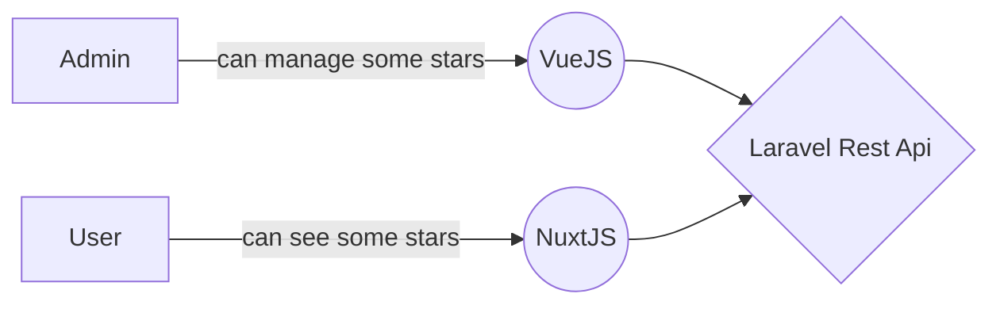

# Stellario 💫

This app aim to create some stars based on true (or not) informations, manage them and show them through a public page.

## Technologies

Stack technologie is based on **Laravel 10** for the Rest Api and **VueJS** for the front-end server. Tailwind is part of the game too 😎. The list below explain how **Stellario 💫** app is organized. It combines a Back-office and a public page. 

 - **App** folder contains everything for public page : *NuxtJS*
 - **Api** folder contains the full Rest Api : *Laravel 10*
 - **Backoffice** folder contains everything for the back-office : *VueJS* (only)

## How it works


> By default command *php artisan serve* on port ```:8000```.
> It can be changed in every **.env** files contains in each folder **app, api & backoffice**

## Requirements

#### PHP 
```
> php -v
> PHP 8.2 (8 or higher)
```
#### MYSQL
```
> mysql --version
> Ver 8.0.3 (8 at least)
```
#### NODE (and NPM)
```
> node --version
> v18 (18 at least)
```


> Also **composer** is required.

## Usage

After **git clone** you'll have to run all commands bellow 👇

#### Laravel

    > cd api
    > composer install
    > cp .env.example .env
    > php artisan db:create stellario // this command create database
    > php artisan migrate:fresh --seed // Create random stars
    > php artisan storage:link // To expose public storage folder
    > php artisan serve // Running on port :8000

Also you can **run test** in order to **test api endpoints**.

    > mkdir tests/Unit // ONLY IF test command bellow not working
    > php artisan test

#### Back-office

    > cd backoffice
    > npm install
    > cp .env.example .env
    > npm run dev // Running on port :5173

#### App (public app)

    > cd app
    > npm install
    > cp .env.example .env
    > npm run dev // Running on port :3000

## Back-office features 

> 📚 Idoc documentations was created in order to test api endpoints. 
> Also describe all the models and fields with their descriptions
> It should be at this address (depends on your config) : [http://localhost:8000/idoc](http://localhost:8000/idoc)

| Api endpoint | Description | More explanations |
|--|--|--|
| Index | get all stars ordered by first_name  | Search by first name, last name, composed first name with last name or popularity (Laravel Ressource) |
| Create | create a star  | By default it has *star.png* file as face (Laravel Observer) + (Laravel Request for validation) |
| Get | Get a star  |  |
| Update | Update a star  | Laravel Request for validation |
| Update face star | Update a face's star  | Remove old one and replace by the new one (Laravel Observer) + (Laravel Request for validation)|
| Update | Remove a star  | Also remove uploaded face image (Laravel Observer)  |


## App features
 
| Feat | Description |
|--|--|
| Index | get all stars ordered by first_name |
| Responsiveness | Screen is different depending on user's screen |


## Documents & Code features

- Test : [test.pdf](https://github.com/DanyLm/stellario/blob/main/docs/test_dev_web_laravel_2023.pdf)
- Convention used for commit : [Conventionnal commit](https://www.conventionalcommits.org/en/v1.0.0/)
> Lint + Eslint has been configured